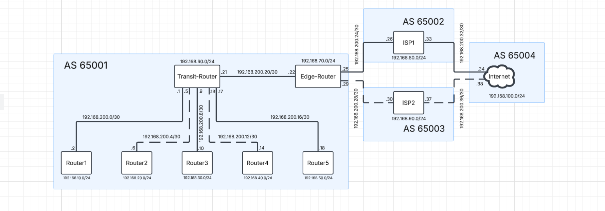

## Multi-AS BGP/OSPF Network Automation Lab

A hands-on networking and NetDevOps learning project combining BGP,
OSPF, Jinja2, YAML, Python, and Netmiko to build, automate,
troubleshoot, and validate a multi-AS network.

### 📌 Project Overview

This project started as an effort to learn Jinja2, Ansible, BGP, and
network automation by building a complete network rather than working
through isolated configuration examples.

The lab models a multi-AS environment with:

AS 65001 --- Internal network

AS 65002 --- ISP1

AS 65003 --- ISP2

AS 65004 --- Internet

Multiple internal routers/sites

An internal Transit Router

An Edge Router

Dual eBGP ISP connectivity

OSPF for internal routing

iBGP between the Transit Router and Edge Router

BGP routing policy using Local Preference and AS-Path
Prepending

End-to-end connectivity testing with ping and traceroute

The project also became a practical troubleshooting exercise. Several
problems appeared while building the lab, including configuration syntax
differences, Jinja2 logic errors, device-role mistakes, BGP peering
problems, unexpected default routes, and missing route advertisements.

Rather than hiding those failures, I documented them because the
troubleshooting process was one of the most valuable parts of the
project.

### 🗺️ Network Topology

High-level traffic design

The intended path for Internet-bound traffic from the internal network
is:

Internal Router
      |
      v
Transit Router
      |
      v
Edge Router
      |
      v
     ISP1
      |
      v
   Internet

The lab also includes ISP2 as a secondary path.

### 🎯 Project Objectives

The original objectives were to:

Build a multi-AS network using BGP and OSPF.

Learn how BGP behaves across internal and external autonomous
systems.

Use BGP policy to influence route selection.

Use Jinja2 to generate device-specific configurations.

Use structured YAML data as configuration input.

Automate configuration deployment.

Troubleshoot routing and automation failures.

Validate the final network using real connectivity tests.

Begin developing practical NetDevOps skills from a networking-first
perspective.

### 🧰 Technologies Used

Networking

BGP

eBGP

iBGP

Local Preference

AS-Path Prepending

Default Route Origination

BGP Route Selection

OSPF

IPv4

Layer 2 / Layer 3 interfaces

VLAN 1 SVI

Point-to-point links

Dual-ISP routing

Ping

Traceroute

Automation / Programming

Python

Jinja2

YAML

Netmiko

Ansible

Ansible Vault

Python dotenv

Network Platform

Arista EOS

### 🏗️ Configuration Architecture

The configuration workflow uses structured device data rather than
manually maintaining a separate configuration template for every device.

YAML device data
       |
       v
   Jinja2 template
       |
       v
Generated device configuration
       |
       v
Python / Netmiko
       |
       v
Network devices

The Jinja2 template uses device roles to determine which configuration
sections should be applied.

For example:

Edge devices receive BGP policy configuration.

Transit/Site devices receive OSPF configuration.

BGP configuration is generated from structured neighbor and
advertisement data.

Interface configuration is generated from interface data.

This allows the same template to generate configurations for multiple
devices while keeping device-specific information in YAML.

### 🐍 Python + Jinja2 Configuration Generation

The first Python component renders the Jinja2 template using the YAML
files associated with each device.

The basic process is:

Load the Jinja2 template.

Locate the YAML device configuration files.

Parse YAML using PyYAML.

Extract the device name.

Render the template with the YAML data.

Write a device-specific configuration file.

Example workflow:

device_configs_yaml/
├── Router1.yml
├── Router2.yml
├── Router3.yml
├── ...
└── Edge-Router.yml

             ↓

        template.j2

             ↓

device_configs/
├── Router1.txt
├── Router2.txt
├── Router3.txt
├── ...
└── Edge-Router.txt

This separation between data and configuration logic was one of
the main concepts I wanted to learn through the project.

### 🤖 Automation Approach: Ansible → Python/Netmiko

Initial approach: Ansible

The original goal was to use:

YAML
 ↓
Jinja2
 ↓
Ansible
 ↓
Network devices

I successfully used Ansible during the project, including Ansible
Vault to protect secrets and other sensitive variables.

However, while using ansible.netcommon.cli_config with Arista EOS, I
encountered a persistent issue where Ansible attempted to send a
commit command even though commit was not present in my
configuration files, templates, playbook, or Python code.

I investigated several possible causes and attempted multiple
approaches, including:

Explicitly setting commit: no

Moving privilege escalation settings into the inventory

Trying arista.eos.eos_config

Changing session behavior

Reviewing the interaction between ansible.netcommon.cli_config and
the Arista EOS network OS

The configuration itself was ultimately being written to the devices,
but I was unable to get the playbook to complete cleanly without the
unexpected commit error.

Decision

Instead of spending the rest of the project forcing Ansible to work, I
changed the deployment layer to Python + Netmiko.

The final workflow became:

YAML
 ↓
Jinja2
 ↓
Generated configuration files
 ↓
Python
 ↓
Netmiko
 ↓
Arista EOS devices

This allowed me to complete the network deployment and focus on the
networking objectives of the project.

Why I consider this an important part of the project

The goal was not simply to demonstrate that I could copy configurations
to routers.

A significant part of the learning experience was discovering that an
automation tool can introduce its own problems. I had to investigate the
behavior, determine what was and wasn't working, evaluate alternatives,
and choose a different implementation that successfully completed the
task.

The Ansible troubleshooting notes are intentionally included in this
repository rather than removed from the project history.

### 🔐 Credential Handling

Credentials were not intended to be stored directly inside the
automation logic.

During the Ansible implementation, I used:

Ansible Vault for secrets and sensitive variables.

For the Python/Netmiko implementation, I use:

Environment variables

python-dotenv

This keeps credentials separate from the device configuration and
automation code.

Do not commit your .env, Ansible Vault password, or other secrets
to GitHub.

### 🧪 Troubleshooting Journey

One of the main goals of this project was not just to make the network
work, but to understand why it failed when it didn't work.

The following issues were encountered and investigated during
development.

1. YAML Files Were Initially Read Incorrectly

I initially attempted to read YAML configuration files using the normal
f.read() approach and pass the resulting content directly into the
template.

That was incorrect for the structure I was using.

I changed the implementation to parse the YAML files using PyYAML
and then pass the resulting dictionary into Jinja2.

Lesson

Structured configuration data should be parsed according to its format
rather than treated as plain text.

2. Cisco vs. Arista EOS Configuration Syntax

Some commands initially came from Cisco IOS examples while the lab
devices were running Arista EOS.

Although the syntax between Cisco and Arista is often similar, it is not
identical.

This produced configuration errors that initially looked like automation
problems but were actually platform/configuration mismatches.

Lesson

Automation does not eliminate the need to understand the target network
operating system.

A template can successfully generate the wrong command just as easily as
the right one.

3. Jinja2 Loop Placement Caused BGP Configuration Errors

I initially placed an exit command inside a Jinja2 loop in the BGP
section.

As a result, every iteration of the loop could execute exit.

This caused the generated configuration to leave BGP configuration mode
before subsequent BGP commands were processed.

For example, I was trying to generate network advertisements, but the
generated configuration had already exited the required configuration
context.

Lesson

When generating CLI configuration with templates, control flow in the
template directly affects CLI configuration context.

The generated configuration must be inspected---not just the template
itself.

4. Configuration Timeout

The automation initially timed out while deploying the configuration.

The timeout was initially associated with the relatively large BGP
configuration block, but further investigation showed that the actual
problem was related to the banner syntax.

The banner delimiter needed to be placed correctly, with EOF on its
own line.

I also learned that network automation timeout values need to account
for the time required by the device to process and validate
configuration.

Lesson

When automation times out, the timeout itself is not necessarily the
root cause.

The generated configuration and the device's response need to be
inspected first.

5. Unexpected commit Command from Ansible

One of the most persistent automation problems occurred while using:

ansible.netcommon.cli_config

I did not have a commit command anywhere in my:

Configuration files

Jinja2 template

Playbook

Python code

However, the device reported:

% Invalid input

when Ansible attempted to execute commit.

I investigated the interaction between the Ansible module and the Arista
EOS network OS and attempted several configuration changes.

The configuration itself was being applied, but I could not eliminate
the erroneous commit behavior and obtain a clean playbook execution.

Final decision

I stopped treating Ansible as a requirement for the project and moved
the deployment layer to Netmiko.

This was not because Ansible is unsuitable for network automation.
Rather, it was a project-level decision to use a working tool while
documenting the unresolved Ansible issue for future investigation.

6. Incorrect Device Role Prevented Routing Configuration

At one point, the Transit Router had been renamed but its role in the
YAML configuration had not been updated.

It was still assigned the wrong role.

Because the Jinja2 template uses device roles to determine which
configuration sections should be generated, the expected BGP/OSPF
configuration was not being applied.

After correcting the role, the expected routing configuration was
generated and applied.

Lesson

When using data-driven automation, incorrect input data can produce a
technically valid configuration that is logically wrong.

The automation can only be as correct as the data driving it.

7. OSPF Neighbors Formed, But Routes Were Missing

After OSPF neighbors formed, I initially expected the VLAN networks to
appear in the routing table.

However, the VLAN 1 interfaces did not have an active physical member in
the VLAN.

The SVI therefore was not behaving as expected for route advertisement.

I investigated the interface state and added:

no autostate

to VLAN 1.

This allowed the VLAN interface to remain operational based on the lab
design, and the associated networks began appearing in the routing
table.

I then applied the same concept to the other routers where VLAN 1 was
being used to represent their internal networks.

Lesson

An interface having an IP address does not automatically mean the
network is operationally reachable or advertised the way you expect.

Interface state matters.

8. BGP Neighbor Formation Problems

OSPF was eventually working, but BGP was not initially forming all
expected relationships.

The first issue was in the Jinja2 template: BGP neighbor configuration
had been incorrectly restricted by a conditional intended for the Edge
Router.

After correcting the template logic, the expected eBGP relationships
formed.

I then discovered that the Edge Router was missing the IP address
required for the intended iBGP relationship with the Transit Router.

After adding the missing address, iBGP formed successfully.

Lesson

When a routing protocol fails:

Check configuration
      ↓
Check interface/IP reachability
      ↓
Check neighbor configuration
      ↓
Check protocol state
      ↓
Check routing table

Do not assume the protocol itself is the only possible failure point.

9. BGP Policy Validation

The project uses BGP policy to intentionally influence route selection.

The Edge Router uses:

Local Preference to prefer the primary ISP path.

AS-Path Prepending to make the secondary path less attractive
from the perspective of external networks.

I validated the behavior using BGP route information rather than
assuming the configuration was working.

I also intentionally used the BGP router ID as a fallback diagnostic
condition: if the intended higher-priority path-selection attributes
failed to produce the expected winner, the lower router ID on ISP2 could
become relevant as a later tie-breaker.

This gave me a useful signal that the intended routing policy was not
behaving as expected.

Lesson

Routing policy should be tested by examining actual path-selection
results, not just by checking whether the configuration commands exist.

10. End-to-End Connectivity Failure

After BGP and OSPF were working, I performed actual connectivity
testing.

The intended path was:

Router1-5
   ↓
Transit
   ↓
Edge
   ↓
ISP1
   ↓
Internet

The first ICMP tests did not follow the intended path.

First discovery: unexpected default route

The internal routers were sending traffic toward:

172.20.20.1

instead of the Transit Router.

I checked the routing table and discovered a static default route that
had not been added by my configuration.

It was part of the lab environment's existing configuration.

I removed the unexpected default route and verified that the Transit
Router became the gateway of last resort.

Second discovery: missing point-to-point advertisements

Traffic still stopped at the next hop.

I tested specific addresses along the path and found that some
point-to-point networks were not being advertised.

After adding the required point-to-point network advertisements,
end-to-end connectivity began working.

Final validation

I was able to:

Reach the internal routers.

Reach the Transit Router.

Reach the Edge Router.

Reach the ISPs.

Reach the Internet router.

Verify that traffic followed the intended routing path.

Lesson

A routing protocol can appear healthy while end-to-end traffic is still
broken.

Protocol adjacency ≠ application/data-plane connectivity.

Actual traffic testing is essential.

### 📊 Validation

The final lab was validated through:

Routing protocol checks

OSPF neighbor formation

BGP eBGP peer formation

BGP iBGP peer formation

Routing table inspection

BGP table inspection

BGP path-selection verification

Connectivity checks

ICMP ping

Traceroute

Point-to-point reachability testing

Internal-to-Internet connectivity

Policy checks

ISP1 preferred as the primary path

AS-Path prepending applied to the secondary path

External peers receiving the internal network routes

### 🧠 Major Lessons Learned

This project taught me several lessons that go beyond individual
commands.

1. Automation requires networking knowledge

Jinja2 and Netmiko can automate configuration deployment, but they
cannot tell you whether the routing design itself makes sense.

2. Generated configuration must be inspected

A correct-looking template can generate incorrect CLI because of:

loops

conditionals

indentation

configuration context

device-specific syntax

3. Troubleshooting should be hypothesis-driven

Instead of repeatedly changing configurations, I learned to:

Observe
  ↓
Form a hypothesis
  ↓
Test the hypothesis
  ↓
Inspect the result
  ↓
Modify the configuration
  ↓
Retest

4. Control-plane health does not guarantee data-plane connectivity

BGP and OSPF neighbors can be established while actual traffic still
fails.

5. Tool choice should serve the engineering objective

Ansible was part of the original design, but the unresolved cli_config
issue led me to use Python/Netmiko for the final deployment.

The important outcome was a working and understood network---not forcing
a particular automation tool into the project.

### 🔭 Future Improvements

This project is intentionally an early-stage NetDevOps learning
project, not a claim of production-grade network automation.

Future improvements could include:

Revisit the Ansible EOS commit behavior and determine the
underlying cause.

Improve automation error handling.

Add automated post-deployment verification.

Compare intended state against actual device state.

Add configuration validation before deployment.

Improve device/inventory data structure.

Expand Python automation capabilities.

Explore more advanced network automation tools after gaining more
experience.

Experiment with replacing the internal OSPF design with an
iBGP-based routing architecture and evaluate the design trade-offs.

I am intentionally not adding technologies such as Docker, Terraform, or
CI/CD simply for the sake of increasing the technology list. The focus
of this project is to build a stronger networking foundation first and
progressively add NetDevOps capabilities.

### 💡 Why I Built This Project

My career direction is NetDevOps Engineering, with a long-term goal
of becoming a Network Engineer / Network Architect with strong network
automation capabilities.

I am approaching NetDevOps from a networking-first perspective:

Strong Networking Foundation
          +
Python / Automation
          +
Configuration Management
          +
Infrastructure Automation
          ↓
       NetDevOps

Rather than learning automation tools independently from networking, I
wanted to use automation to solve actual networking problems.

This project was my first major step in that direction.
